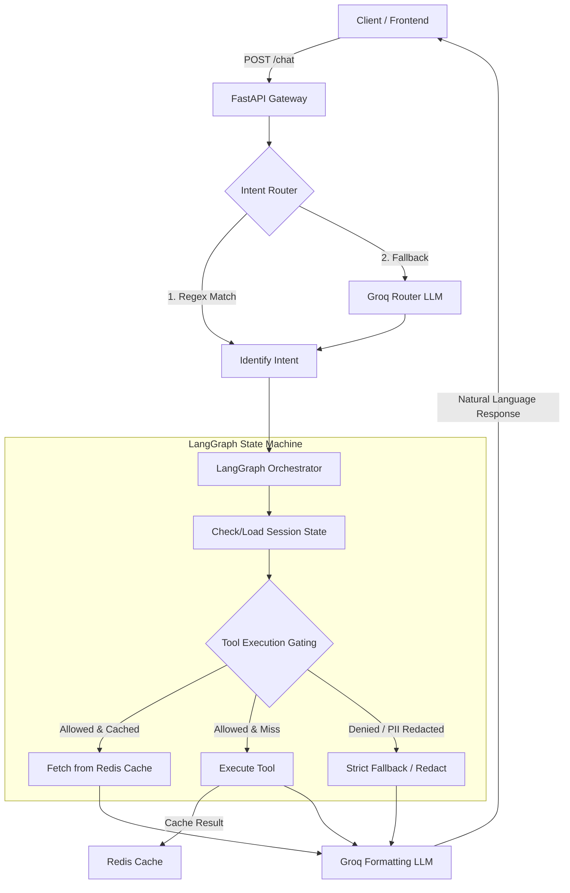
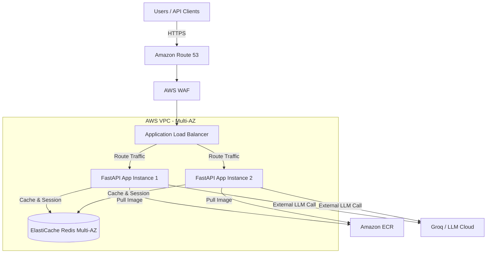

# Reelo AI — Production Chat Service

A production-oriented AI chat service built with **FastAPI**, **LangGraph**, **Groq** (Llama 3.3 70B), **Redis**, and **Pydantic**. Implements tool-first execution with deterministic compliance gating and controlled LLM usage.

## Quick Start

```bash
# 1. Install dependencies
pip install -r requirements.txt

# 2. Configure environment
cp .env.example .env
# Edit .env and add your GROQ_API_KEY

# 3. (Optional) Start Redis for caching + session persistence
docker run -d -p 6379:6379 redis:latest
# If Redis is unavailable, the system degrades gracefully (runs uncached)

# 4. Run the demo (in-process, no server needed)
python demo.py

# OR start the API server
uvicorn main:app --reload --port 8000
```

## System Architecture & Scaling

### 1. Application Flow Diagram


### 2. Production AWS Scaling Architecture
To run Reelo AI at scale with high availability, low latency, and zero single points of failure (SPOF), we recommend the following AWS deployment architecture:



### 3. Scaling & Distributed System Patterns

#### Containerization & Image Registry (Docker & Amazon ECR)
- **Immutable Builds**: The application is packaged into a lightweight Docker container (using a multi-stage `python:3.11-slim` base image) and pushed to **Amazon ECR**.
- **CI/CD Pipeline**: GitHub Actions automatically runs tests, builds the production Docker image on git tags/main branch commits, and pushes it to ECR with unique image tags (e.g., git commit hashes).

#### Load Balancing & Compute (ALB & ECS Fargate)
- **AWS Fargate**: We run containers serverlessly on AWS ECS. Fargate removes the overhead of managing EC2 servers.
- **Application Load Balancer (ALB)**: Routes incoming requests to active ECS Fargate tasks. Performs active health checks (e.g., hitting the `/health` endpoint every 15 seconds) to immediately terminate and replace unhealthy container instances.
- **Horizontal Pod Autoscaling**: ECS Service Auto Scaling adjusts the task count dynamically:
  - **Scale-out trigger**: When average CPU utilization exceeds 70% or Memory exceeds 80% for 3 consecutive minutes.
  - **Scale-in trigger**: When CPU utilization drops below 30% to conserve cost.

#### Distributed State & Cache (Amazon ElastiCache for Redis)
- **Stateless Orchestration**: The FastAPI application instances are entirely stateless. They load session metadata (e.g. basket contents, previous intents) from Redis at the beginning of a request and commit changes back at the end.
- **Multi-AZ Replication**: Amazon ElastiCache Redis is configured in a replication group (1 Primary, 1-2 Read Replicas) across multiple Availability Zones to ensure automatic failover and scale read traffic.
- **Tool Caching**: Caching API responses in Redis saves massive computation costs, eliminates DB loads, and bypasses external API latencies.

#### Distributed System Challenges & Resolutions
- **LLM Rate Limiting (Groq)**: External LLMs impose strict tokens-per-minute (TPM) and requests-per-minute (RPM) limits. 
  - *Mitigation*: We implement client-side rate-limiting using token-bucket patterns in Redis. For offline bulk processing, requests are queued via **Amazon SQS** and processed by worker nodes to avoid hitting external rate limits.
- **Concurrency & Race Conditions (Redlock)**: Under concurrent user requests for the same `session_id`, session state updates could conflict.
  - *Mitigation*: We use a distributed lock algorithm (Redlock) in Redis to serialize state changes on a per-session basis.
- **Circuit Breaker Pattern**: If Redis or the Groq API goes down, the orchestrator degrades gracefully using local memory cache and returns pre-configured structural JSON payloads rather than failing completely.

### File Structure

```
main.py                    # FastAPI entry point (POST /chat, GET /health)
data_loader.py             # Pydantic-validated seed data loader
redis_client.py            # Redis connection manager + caching layer
observability.py           # Structured JSON logging + request traces
demo.py                    # 5-query live demo script
data/seed_data.json        # Seed dataset (products, inventory, kb_docs, etc.)
tools/
  core_tools.py            # 5 deterministic tools with Redis caching
  allowlist.py             # Tool permissions per user_type + PII redaction
chains/
  router.py                # Intent classification (regex-first, LLM fallback)
  orchestrator.py          # LangGraph state machine (6 canonical chains)
state/
  session.py               # Redis-backed sessions with in-memory fallback
```

### Where Things Live

| Concern | File | Key Design Decision |
|---------|------|---------------------|
| **Routing** | `chains/router.py` | Regex-first (zero tokens), Groq LLM fallback only when no match |
| **Tools** | `tools/core_tools.py` | 5 deterministic tools, Redis-cached, Pydantic input validation |
| **Permissions** | `tools/allowlist.py` | Fail-closed tool ACL per user_type, recursive PII redaction |
| **Chains** | `chains/orchestrator.py` | LangGraph StateGraph: route → tools → LLM format |
| **Session** | `state/session.py` | Redis primary + in-memory L1 fallback, 1hr TTL |
| **Caching** | `redis_client.py` | Per-tool TTL (30s stock → 10min compliance), graceful degradation |
| **Observability** | `observability.py` | JSON-structured traces with per-tool latency, cache hits, token estimates |

### Canonical Chains

| Intent | Tool Chain | LLM Role |
|--------|-----------|----------|
| SALES_RECO | hot_picks → compliance_filter | Format allowed products |
| COMPLIANCE_CHECK | compliance_filter | Explain blocked/allowed status |
| VENDOR_ONBOARDING | vendor_validate (+ kb_search) | Format checklist |
| OPS_STOCK | stock_by_warehouse | Format warehouse breakdown |
| GENERAL_KB | kb_search | Summarize KB snippets |
| BASKET_FOLLOWUP | Session state only | Confirm basket addition |

### Redis Caching Strategy

| Tool | TTL | Rationale |
|------|-----|-----------|
| `hot_picks` | 5 min | Product catalog changes infrequently |
| `compliance_filter` | 10 min | Regulatory rules are stable |
| `stock_by_warehouse` | 30 sec | Inventory is volatile |
| `kb_search` | 5 min | Knowledge base updates rarely |
| `vendor_validate` | Never | Each submission is unique |

### Security

- **Tool allowlist**: `internal_sales` → 4 tools, `portal_vendor` → 2 tools, `portal_customer` → kb_search only
- **PII redaction**: Regex scrubbing (SSN, email, phone, credit card) + field-level key filtering — applied before ANY LLM call
- **LLM guardrails**: Max 600 output tokens, max 2000 chars tool context, never invent facts

## API

### POST /chat
```json
{
  "query": "Give me hot picks for CA under $5000",
  "session_id": "optional-uuid",
  "user_type": "internal_sales"
}
```

### GET /health
```json
{
  "status": "ok",
  "service": "reelo-ai-chat",
  "redis": "connected"
}
```

## Demo Queries

1. **Sales**: "Give me hot picks for CA under $5000"
2. **Compliance**: "Why is SKU-1006 not available in CA? Suggest alternatives."
3. **Ops**: "How much stock does SKU-1005 have and where?"
4. **Vendor**: "I'm uploading a product missing Net Wt and no lab report — what do I fix?" *(user_type=portal_vendor)*
5. **Basket**: "Ok add 2 of the first one to the basket"
